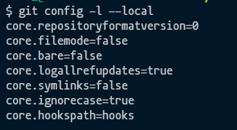

 
# Adding git hooks to repository

- We initialize the repository with the following command:
 ```
 git init
 ```

-  We change the default configuration to point to a new folder hooks inside our root folder

 
 ```
 mkdir hooks
 git config core.hooksPath hooks
 ```
- Check configation with the following command:
 
 ```
 git config -l --local
 ```
whe should see the following:

 

 We have to give permissions to run the hooks:
 ```
 chmod +x ./hooks/pre-commit
 ```

## Optional

- Here is an example on bash para precommit message:

```bash
#!/bin/sh -e
echo $( pwd)
echo $(ls)

if [ ! -d "./node_modules" ] 
then
    echo "Error: Directory /node_modules does not exists, please run npm install on root folder."
    exit 1
fi

precommit ()
{
  npx lint-staged
}
 
precommit
```