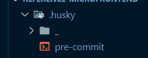

# Installing husky

## Installing required packages

```bash
npm i -D husky
npm set-script prepare "husky install" OR symple create a script "prepare": "husky install" in package.json
```

## Prepare husky for hooks

- The following command will add the hooks to the .git/hooks directory

```bash
npm run prepare
```

This will create a "\_" folder in the `.husky` directory.



## Creating a hook and make a commit

```bash
npx husky add .husky/pre-commit "npm test"
git add .husky/pre-commit
git commit -m "Keep calm and commit"
# `npm test` will run
```

Then, you can add the desire scripts to run inside the pre-commit file.

```bash
#!/bin/sh
. "$(dirname "$0")/_/husky.sh"

npm run pre-commit
npm run lint-staged
```
