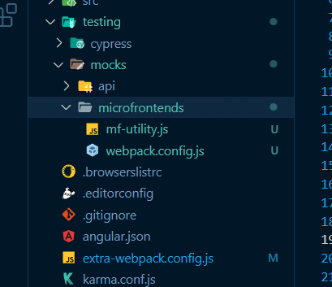

# Add standalone to angular single spa

- Make sure you install

```bash
npm i -D webpack-cli html-webpack-plugin standalone-single-spa-webpack-plugin
```

- You extra webpack config `extra-webpack.config.js`, Should look tike this:

```js
const singleSpaAngularWebpack =
  require("single-spa-angular/lib/webpack").default;
const HtmlWebpackPlugin = require("html-webpack-plugin");
const StandalonePlugin = require("standalone-single-spa-webpack-plugin");
const { merge } = require("webpack-merge");

module.exports = (config, options) => {
  const singleSpaWebpackConfig = singleSpaAngularWebpack(config, options);
  const { mode } = config;
  const standaloneExtraConfig = {
    plugins: [
      new HtmlWebpackPlugin({
        filename: "standalone.html",
      }),
      new StandalonePlugin({
        appOrParcelName: "mf-one",
        importMap: {
          imports: {
            "mf-one": "/main.js",
            "@ess:mf-utility": "http://localhost:5202/main.js",
          },
        },
      }),
    ],
  };

  // Feel free to modify this webpack config however you'd like to
  return merge(singleSpaWebpackConfig, {
    externals: ["@ess:mf-utility"],
    ...(mode === "development" ? standaloneExtraConfig : {}),
  });
};
```

## Configuring mock server

### Add folder structure for mock server

Markup : 

### Inside files

- mf-utility.js add code that we need to consume from the mock server
- webpack.config.js add configuration for the mock server(next step)

### Configuration for the mock server

```js
const path = require("path");

module.exports = (env) => {
  const entryDir = path.resolve(__dirname, `./${env.mockFile}`);
  const outputDir = path.resolve(__dirname, "./buildMocks");
  return {
    entry: entryDir,
    output: {
      libraryTarget: "system",
      path: outputDir,
    },
    devServer: {
      headers: {
        "Access-Control-Allow-Origin": "*",
      },
      allowedHosts: "auto",
      static: {
        directory: outputDir,
      },
      compress: true,
      port: env.PORT,
    },
  };
};
```

### Add script to package.json

- Don't forget to replace `"mockFile": "mf-utility.js"` and repalce `"PORT": "5202"` for the port on you `extra-webpack.config.js`.

```json
  "scripts": {
    ...
    "start:mf-utility:mock": "webpack-dev-server --config testing/mocks/microfrontends/webpack.config.js --mode=development --env mockFile=mf-utility.js --env PORT=5202",
    ...
  },
```

#### At this point you should have the mock running at `http://localhost:5202/main.js` ------> from `extra-webpack.config.js`

### Adding standalone template

- Create a `src/index.ejs` file with the following content:
- This is also adding angular material fonts

```html
<!DOCTYPE html>
<html lang="en">
  <head>
    <meta charset="UTF-8" />
    <meta http-equiv="X-UA-Compatible" content="IE=edge" />
    <meta name="viewport" content="width=device-width, initial-scale=1.0" />
    <title>Standalone page</title>
  </head>
  <body>
    <script src="https://ajax.googleapis.com/ajax/libs/webfont/1.5.10/webfont.js"></script>
    <script defer>
      try {
        console.log("Start Google Font Loading");
        WebFont.load({
          google: {
            families: ["Roboto", "Material+Icons"],
          },
          timeout: 2000,
        });
      } catch (error) {
        console.log("Google Font error");
        console.log(error);
      }
    </script>
    <script src="https://cdn.jsdelivr.net/npm/zone.js@0.11.3/dist/zone.min.js"></script>
  </body>
</html>
```

- Restart the app to see the changes in the standalone page

#### At this point you should have

- The Mock running at `http://localhost:5202/main.js.js` ------> PORT from `extra-webpack.config.js`
- The App running at `http://localhost:4202/main.js.js`
- The standalone page at `http://localhost:4202/standalone.html`

####

## Optional to run mock server alongside with the application

### Install concurrently

```bash
npm i -D concurrently
```

### Add script to package.json

```json
"scripts": {
    ...
    "start:mf-utility:mock": "webpack-dev-server --config testing/mocks/microfrontends/webpack.config.js --mode=development --env mockFile=mf-utility.js --env PORT=5202",
    "start:dev": "concurrently --names \"SERVER,UTILITY-MOCK\" -c \"bgBlue.bold,bgMagenta.bold\" \"npm run serve:single-spa:mf-one\" \"npm run start:mf-utility:mock\""
    ...
  },
```

## Notes

- Don't forget to configure the port for the mock server in `package.json` script and `extra-webpack.config.js`
- This is a very simple example, you can use the same approach for other microfrontends
- This example is for a MF created with single-spa-cli.
